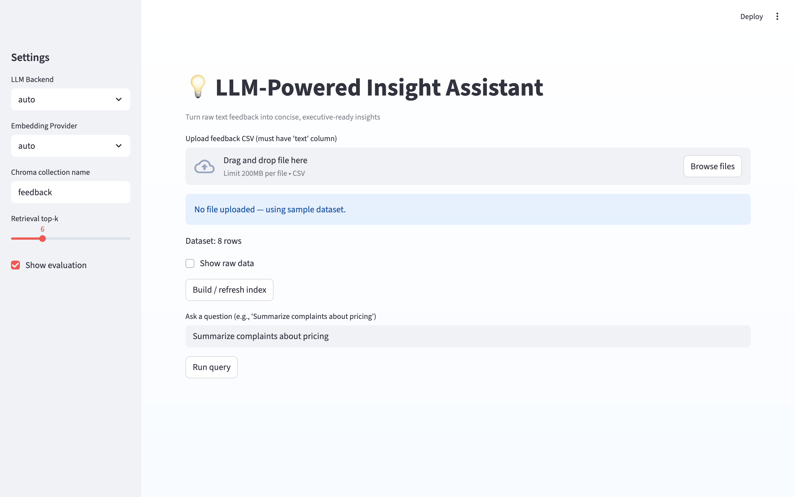
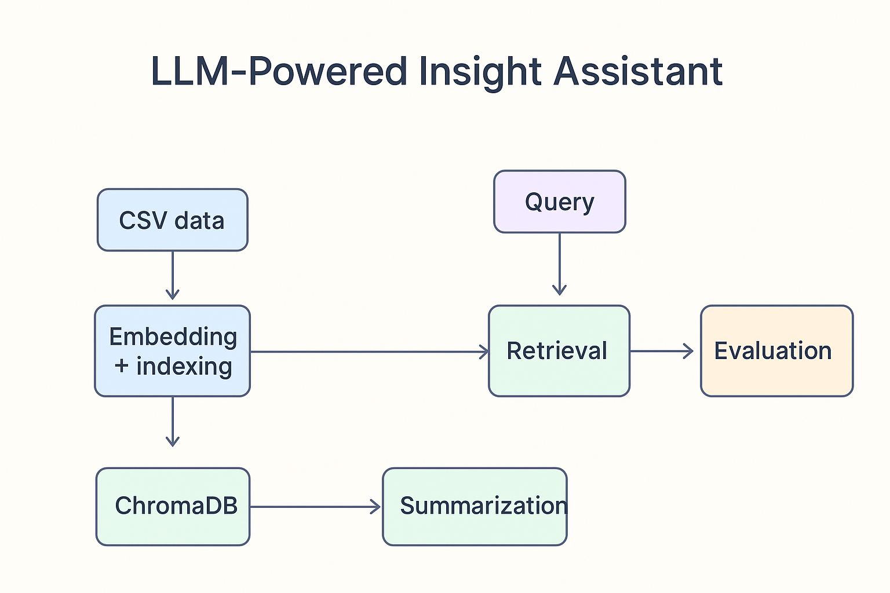

<p align="center">
  
</p>

# 💡 LLM-Powered Insight Assistant

Turn unstructured customer feedback into **executive-ready insights** — powered by Retrieval-Augmented Generation (RAG), ChromaDB, and modular LLM backends.

This project demonstrates **end-to-end LLM application design**, **prompt engineering**, and **automated evaluation** — the same building blocks used in production-grade AI systems.

---

## 🖼️ Preview

<p align="center">
  
</p>

**Demo:** Ask questions like *"Summarize complaints about pricing"* and watch the assistant:
1. Retrieve relevant customer feedback,
2. Extract recurring themes and representative quotes,
3. Generate a polished executive summary,
4. Evaluate its own performance using both **semantic similarity** and **LLM-based rubrics**.

---

## ⚙️ Features

| Capability | Description |
|-------------|-------------|
| **Dual LLM Backend** | Toggle between OpenAI GPT models and a local HuggingFace model (`google/flan-t5-large`). |
| **ChromaDB Vector Store** | Local, persistent retrieval (DuckDB + Parquet). |
| **Flexible Embeddings** | OpenAI embeddings or SentenceTransformers (`all-MiniLM-L6-v2`). |
| **Structured Prompt Chains** | YAML-based prompt templates for reproducible theme extraction and summaries. |
| **Automated Evaluation** | Combines LLM rubric scoring and cosine-similarity semantic metrics. |
| **Streamlit UI** | Clean, light-themed app that feels like a production dashboard. |

---

## 🧠 Architecture

<p align="center">
  
</p>

### Pipeline:
1. **Data Ingestion:** Load text feedback from CSV.  
2. **Embedding + Indexing:** Compute vector representations and store in ChromaDB.  
3. **Retrieval:** Find top-matching feedback for a query.  
4. **Summarization:** Generate structured theme summaries and executive reports via LLM.  
5. **Evaluation:** Use both LLM rubric and semantic-similarity scoring for transparent quality checks.  
6. **Visualization:** Sentiment distribution and theme analytics with Plotly.

---

## 🧩 Quickstart

### 1. Clone and install
```bash
git clone https://github.com/alfonsobonilla/llm-insight-assistant.git
cd llm-insight-assistant
pip install -r requirements.txt
```

### 2. (Optional) Add OpenAI key
```bash
export OPENAI_API_KEY=sk-...
```

### 3. Run the app
```bash
streamlit run app.py
```

### 4. Upload or use sample data
A sample dataset (data/sample_feedback.csv) is provided to test immediately.

## 🧾 Configuration

All runtime options live in:

config/settings.yaml → model + embedding settings

config/prompts.yaml → editable prompt templates

You can switch between:
```yaml
llm:
  backend: "openai"  # or "hf" (local)
embeddings:
  provider: "auto"   # "openai", "local", or "auto"
```

---

## 🔬 Evaluation Example
The app reports:

Semantic Similarity: Mean and max cosine similarity vs retrieved texts

LLM Rubric Evaluation: 0–5 scores for relevance, coherence, coverage, sentiment accuracy

Example output:
```json
{
  "relevance": 4.8,
  "coherence": 4.5,
  "coverage": 4.2,
  "sentiment_accuracy": 4.7
}
```

---

## 🧭 Roadmap
✅ MVP with dual LLM backends
✅ Evaluation loop (LLM rubric + similarity)
⏳ Human-in-the-loop feedback loop
⏳ Multilingual theme extraction
⏳ Advanced analytics dashboard (theme trends over time)

---

## 🧰 Tech Stack
| Layer      | Tools                                             |
| ---------- | ------------------------------------------------- |
| Frontend   | Streamlit (light theme, Plotly charts)            |
| Backend    | Python (LLM pipeline, evaluation logic)           |
| Embeddings | SentenceTransformers / OpenAI                     |
| Vector DB  | ChromaDB                                          |
| Models     | GPT-4, Flan-T5-large                              |
| Infra      | Local development (optional API-based deployment) |

---

## 👨‍💻 Author
Alfonso Bonilla
Senior Data Scientist (NLP & Applied AI)
[LinkedIn](http://linkedin.com/in/alfonsobonilla)

---

## ⭐ Acknowledgements
Built using OpenAI, HuggingFace, and Chroma.